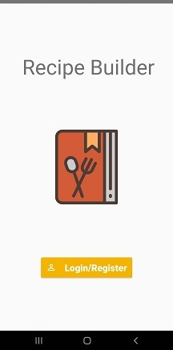
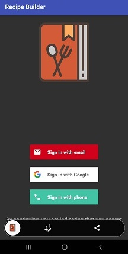
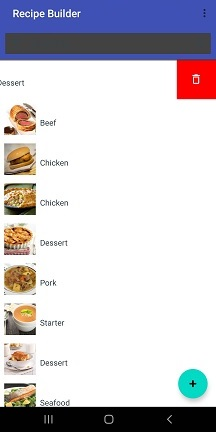
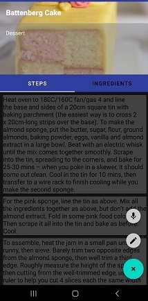

# Recipe Builder
A mobile app for making and storing recipes as a part of ITEC 4860 - Software Development Project course. Our team decided to take the unique challenge of making two apps simultaneously. This is the mobile app that I developed. The web application sits in a private repo owned by the instructor. Originally they had a single Firebase backend servicing things, but it has since been turned off.

## Login

## Authentication options
The login data was saved to Firestore, which would sync the login data across the web and mobile applications.

## Sample recipe list
Generated by RecipeUtil.kt using api data from themealdb.com, but the api has changed since then so the data is a little incomplete now when pulled by RecipeUtil.

## Sample recipe
Adding and deleting a recipe on mobile or web was synced so the lists were consistent. One could edit on one and the other would update accordingly.

